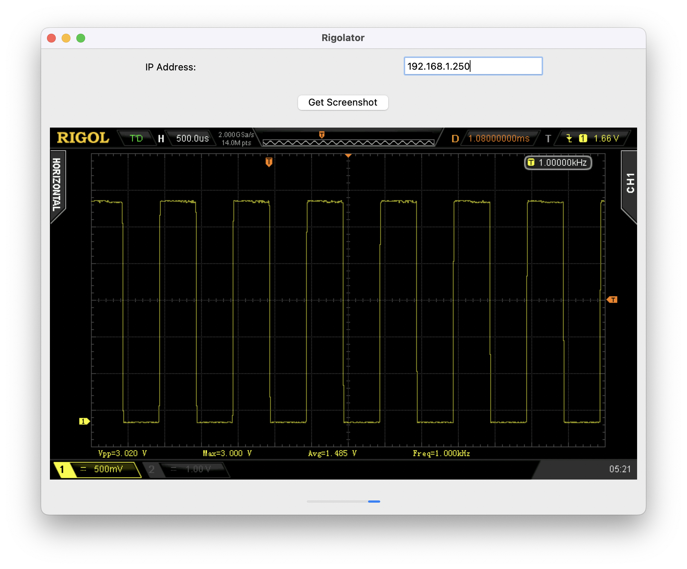

# Rigolator

> Rigolators mount up!



A macOS GUI application for capturing screenshots from Rigol DS2102A oscilloscopes over network connection.

## Features

- Connect to Rigol oscilloscope via IP address
- Capture and display screenshots in real-time

## Prerequisites

- macOS (tested on macOS 14.0+)
- Python 3.11 (required for proper tkinter support with py2app)
- Rigol DS2102A oscilloscope connected to network
- Oscilloscope configured to accept connections on port 5555

## Installation and Setup

### 1. Install Python 3.11 (if not already installed)

```bash
brew install python@3.11
```

### 2. Clone or Download the Project

```bash
git clone https://github.com/skot/rigolator
cd rigolator
```

### 3. Create a Virtual Environment

```bash
python3.11 -m venv venv
source venv/bin/activate
```

### 4. Install Dependencies

```bash
pip install -r requirements.txt
```

### 5. Install Tkinter (if not already available)

If you get tkinter import errors, install python-tk:

```bash
brew install python-tk@3.11
```

## Building the Standalone App

### 1. Ensure Virtual Environment is Active

```bash
source venv/bin/activate
```

### 2. Clean Previous Builds

```bash
rm -R build dist
```

### 3. Build the App

```bash
python3.11 setup.py py2app
```

### 4. Test the App

You can test the app from the command line first:

```bash
./dist/Rigolator.app/Contents/MacOS/Rigolator
```

Or double-click `dist/Rigolator.app` in Finder.

## Project Structure

```
rigolator/
├── pyscoper.py          # Main application file
├── setup.py             # py2app configuration
├── venv/                # Virtual environment
├── dist/                # Built application (after build)
│   └── Rigolator.app     # Standalone macOS app
└── build/               # Build artifacts
```

## Usage

1. Launch the app by double-clicking `Rigolator.app`
2. Enter your oscilloscope's IP address
3. Click "Get Screenshot" to capture and display the current screen
4. The progress bar will show while capturing

## Troubleshooting

### App Won't Launch

If you get a "Launch Error" dialog:

1. Try running from terminal to see error messages:
   ```bash
   ./dist/Rigolator.app/Contents/MacOS/Rigolator
   ```
3. Ensure your virtual environment is active during build

### Tkinter Import Errors

Install python-tk:
```bash
brew install python-tk@3.11
```

### Connection Issues

- Verify oscilloscope IP address is correct
- Ensure oscilloscope is configured to accept network connections
- Check that port 5555 is open and accessible
- Verify oscilloscope and computer are on the same network

### Build Issues

If you encounter build errors:

1. Make sure your python virtual environment was made with Python3.11
2. Make sure the virtual environment was activated when you installed the pip libraries 
3. Make sure the virtual environment was activated when you built the app.

## Development

To run the app directly from Python (for development):

```bash
source venv/bin/activate
python pyscoper.py
```

## Distribution

The built app (`dist/Rigolator.app`) is a self-contained macOS application that can be:

- Copied to other Macs (with similar macOS versions)
- Moved to `/Applications` folder
- Distributed to other users
